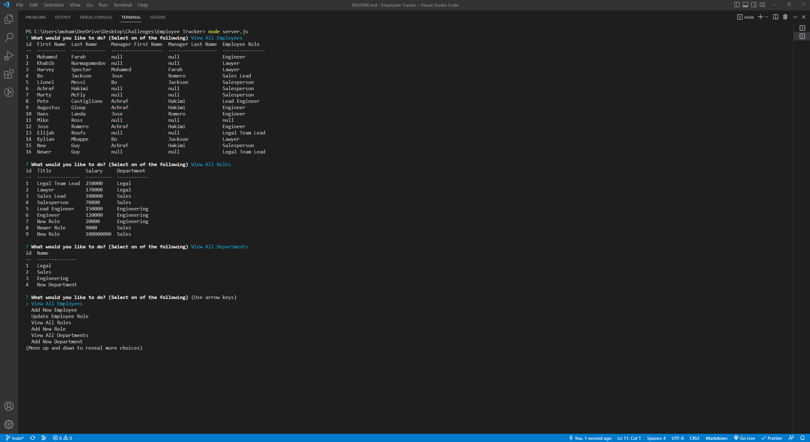

# employee-tracker 

# Description

This project utilizes technologies and dependencies like node, inquirer, mysql, console.table, and the mysql2 package.

- This is a walkthrough video showing how the project works.

  https://drive.google.com/file/d/1RRep3sCD3oFqGk9YA52-U3a9oAxUeJ4X/view

- This is of the project being used in the terminal.

  

## Table of Contents

- [Installation](#installation)
- [Usage](#usage)
- [Credits](#credits)
- [License](#license)

# Installation

The required installations and dependencies in order to use this app is node, inquirer, ctable, the my mysql2 package and and mysql. Make sure you have downloaded each of these dependencies or the project will not work.

# Usage

Navigate to the file and open the terminal. Type in "mysql -u root -p" and then type in "source db/schema.sql" and exit out of the sql terminal. Type in "node server.js" in the terminal and you will be prompted with the questions.

# Contributors

I am currently the lone contributor.

# License

This project uses the MIT license.

# Tests

There are currently no tests for this application so far.

# Questions

Contact me at mohamedfarah0508@gmail.com for any questions.
